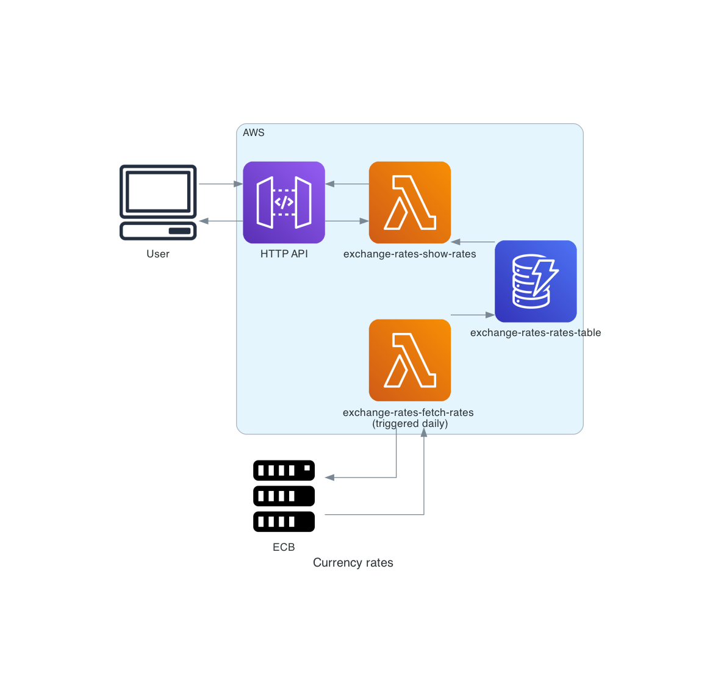

### Project scope

Currency exchange tracking application in the AWS lambda environment.  The application relies on 
[European Central Bank Data](https://www.ecb.europa.eu/stats/policy_and_exchange_rates/euro_reference_exchange_rates/html/index.en.html). 
Exchange rates are fetched every day and stored in a DynamoDB table. The application exposes a public REST API endpoint 
that provides current exchange rate information for all tracked currencies and their change compared to the previous day 
for all the tracked currencies. Data provided is cached in API Gateway, however after each successful data fetch
cache is flushed.

### Architecture

API endpoint is served using serverless infrastructure (API Gateway + Lambda + DynamoDB) and data is loaded using Lambda
function that is run on daily basis using CloudWatch (EventBridge) Rule. API Gateway cache is turned on, so only first 
call is served from Lambda and DynamoDB.



### Dependencies

This project is based on Python3.10, Node.js 18.15, [poetry 1.4.0](https://python-poetry.org/) and [serverless 3.30.1](https://www.serverless.com/).

### Development

Install poetry dependencies:

```commandline
poetry install
```

And install npm dependencies:

```commandline
npm install
```

Activate poetry env:

```commandline
poetry shell
```

### Deployment

Install serverless dependencies
```commandline
npm install
```

Make sure you have AWS credentials set up. Deploy using:
```commandline
serverless deploy --region eu-west-1
```

URL with rates is provided in `serverless deploy` command output

Fill database with the latest records:
```commandline
serverless invoke -f storeRates --data '{"limit": 1}' --region eu-west-1
```

or 

```commandline
serverless invoke -f storeRates --data '{"limit": 5}' --region eu-west-1
```

After testing destroy infrastructure:

```commandline
serverless remove --region eu-west-1
```

### Caveats

`Store events` Lambda function partially bases on event received. If triggered with empty event - reloads only newest 
rates from ECB, however if `limit` passed in an event - such amount of days is being loaded into DynamoDB.
